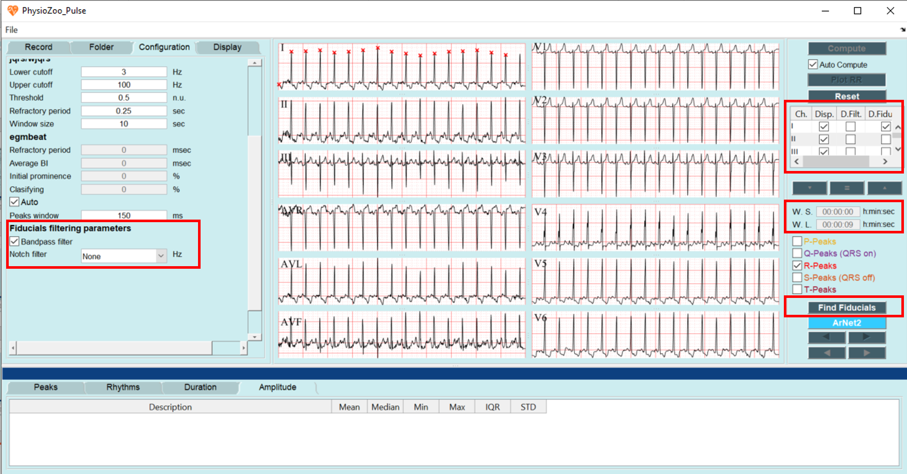
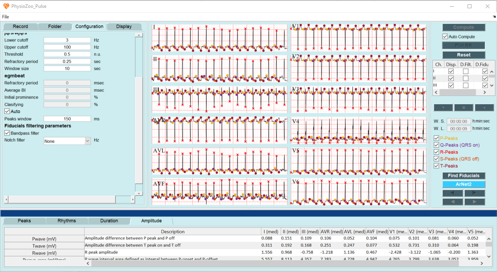
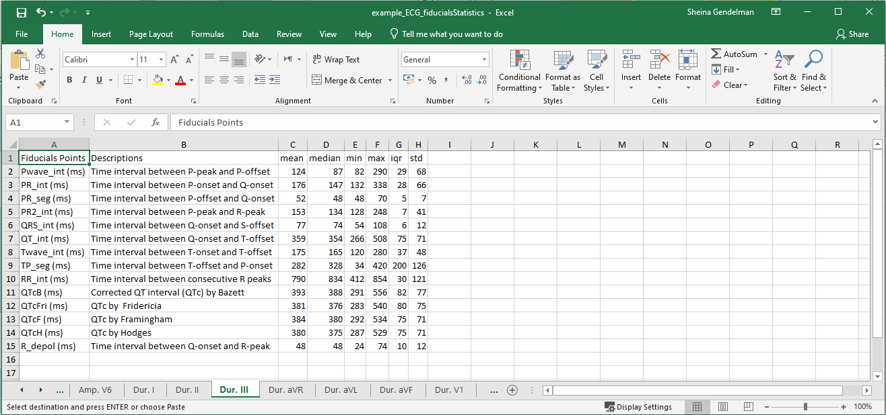

ECG morphological analysis
==========================

In this tutorial you will learn how to use **PhysioZoo ECG** to compute the morphological biomarkers and export the computed values.
(link: https://physiozoo.com/)

**Introduction**
----------------------
An electrocardiogram (ECG) is a simple test that uses temporary electrodes on the chest and limbs to monitor, track, and document the heart's electrical activity. 
The ECG provides information about the function of the intracardiac conduction system, which is responsible for generating and propagating electrical impulses through the heart. 
The ECG records the sequence of depolarization and repolarization of the atria and ventricles, which are represented by different waves on the ECG.

Studying the morphological statistics of the signal may provide information on the underlying physiological heart condition. 
**PhysioZoo ECG** provides the framework and tools for extracting morphological biomarkers from the ECG signal.

**Performing ECG morphological analysis**
------------------------------------------------------------
Start by entering the ECG interface by clicking on the 'Peak Detection' tab on the top right, then load some ECG example by clicking File -> Open data file -> ECG_example.txt. The program will automaticly present the 
ECG file you uploded.

To perform your morphological analysis, please follow these instructions:

#. Prefiltering the signal: On the left panel, select the "Configuration" tab. On the bottom of the tab, you will find a section labeled: **Fiducials filtering parameters** which refers to two filters applied to your signal before analysis:
   
   * The bandpass filter in the range of [0.67,100] Hz. Its purpose is to remove the baseline wander and high frequency noise. Check the box labeled *Bandpass filter* if you want to use it

   * The notch filter. Its purpose is to remove the powerline interface. If you want to use it, choose the frequency of the powerline interface of the country where the ECG was recorded.

#. Definition of the window for anlysis: On the right panel, define the W.S. (start of the window) and the W.L. (length of the window) you want to analyze. You can analyze all of your signal or part of it. Note that if you analyze a long window,it may take some time. 

#. Visualization of multiple leads: Choose the leads you want to visualize and the leads on which you want to plot the fiducial points.
 
#. Click the **Find Fiducials** button.

Congrats! You have made your first morphological analysis with **PhysioZoo ECG**!
The biomarkers are divided into two different categories: Duration and Amplitudes, the statistical measurments of the biomarkers will be presented in a table, in the bottom panel. 

.. note:: For multilead anlysis only the median of each biomarker will be presented in the table, while for singel lead anlysis 6 statistical mesurment will be presented for each biomarker:
mean, median, min, max. IQR and std.

**Exporting morphological biomarkers**
--------------------------------------------

You can export the morphological biomarkers by **PhysioZoo ECG**. Go to File -> Save Fiducial statistics. The excel file that you saved containe all the computed biomarkers for each lead. 

